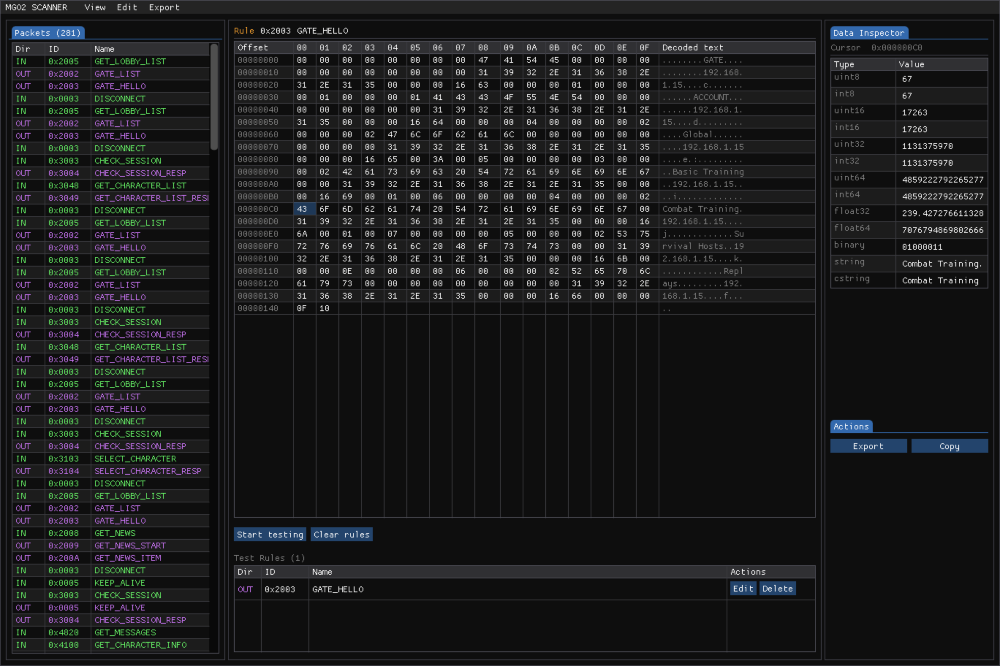

# MGO2 Scanner

A real-time network packet scanner and test tool for MGO2 (Metal Gear Online 2), built with Node.js and a Dear ImGui frontend rendered in the browser via WebGL2.

## Features

- **Live packet capture** — intercepts TCP traffic between the MGO2 client and server across all game ports
- **Packet inspector** — hex dump viewer with ASCII side-by-side, byte-level cursor navigation, and a multi-type data inspector (uint8/16/32/float/string)
- **Packet spoofing** — create persistent test rules per command ID and direction (IN/OUT) that replace payloads on the fly
- **Packet exclusion** — hide specific command types from the capture list to reduce noise
- **Hex search** — search across the selected packet's payload by string, hex, uint8/16/32 value with next/prev navigation

## Demo



## Usage

In RPCS3, go to settings and in the `Metal Gear Online` section set DNS IP address to `0.0.0.0`, then...

```bash
npm install
npm run start
```

The web UI opens automatically at `http://127.0.0.1:8080`.

Set `DISABLE_DNS=true` to skip the DNS server (e.g. if port 53 is already in use).
